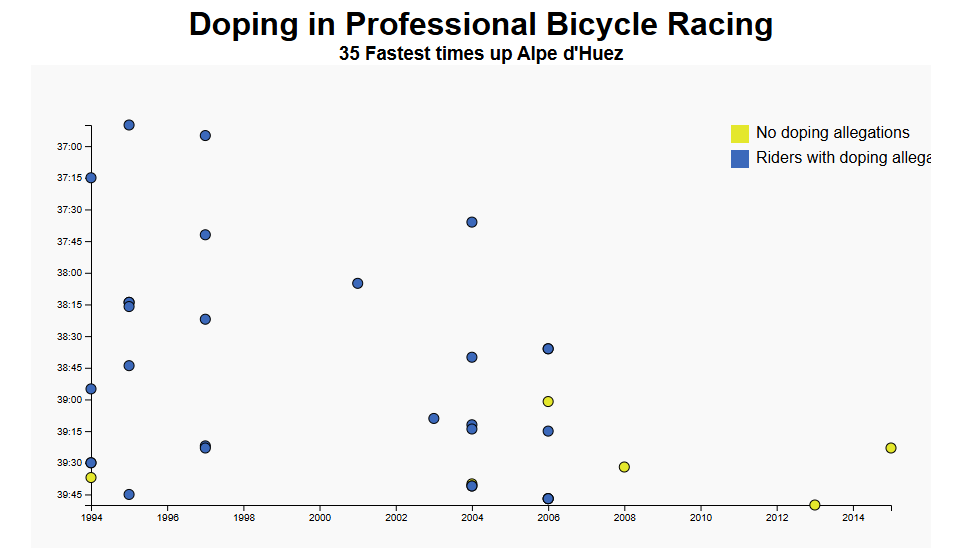

# 🔵 Scatter Plot with D3.js

This project is a simple **Scatter Plot** built using [D3.js](https://d3js.org/). It visualizes a set of data points on an XY plane, demonstrating how to use D3 scales, axes, and SVG circles to represent quantitative relationships.

## 💡 Features
- Dynamic scaling of X and Y axes based on data
- Circle elements plotted based on X and Y values
- Tooltips (optional) to show data on hover

## 🔧 Technologies Used
- HTML
- CSS
- JavaScript
- D3.js v7.9.0

## 📷 Preview

## 🔗 Live Demo

[Click here to view the live project](https://tapubormon.github.io/scatter-plot-graph-d3/)

